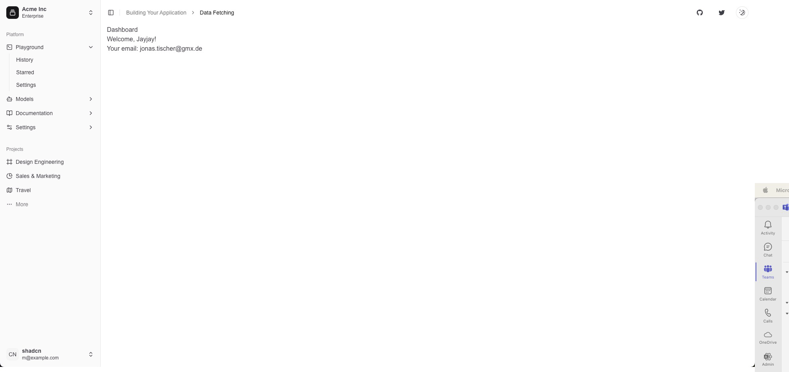

<a href="https://github.com/JonasTischer/django-next-template">
  
  <h1 align="center">Django Next.js Template</h1>
</a>

<p align="center">
  Jumpstart your full-stack development with Django and Next.js!
</p>

<p align="center">
  <a href="https://twitter.com/JonasTischer">
    
  </a>
</p>

<p align="center">
  <a href="#introduction"><strong>Introduction</strong></a> ·
  <a href="#installation"><strong>Installation</strong></a> ·
  <a href="#tech-stack--features"><strong>Tech Stack + Features</strong></a> ·
  <a href="#author"><strong>Author</strong></a>
</p>
<br/>

## Introduction

This template combines Django 5 for the backend and Next.js 14 for the frontend. It includes JWT authentication on the backend and Shadcn UI components for the frontend. This setup helps you start building full-stack web applications more quickly.

## Installation

Clone & create this repo locally with the following command:

```bash
git clone https://github.com/JonasTischer/django-next-template.git
cd django-next-template
```

### Backend Setup

1. Navigate to the backend directory:

   ```sh
   cd backend
   ```

2. Install dependencies using Poetry:

   ```sh
   poetry install
   ```

3. Copy `.env` to `.env.local` and update the variables.

4. Run migrations and start the Django server:
   ```sh
   poetry run python manage.py migrate
   poetry run python manage.py runserver
   ```

### Frontend Setup

1. Navigate to the frontend directory:

   ```sh
   cd frontend
   ```

2. Install dependencies using Bun:

   ```sh
   bun install
   ```

3. Start the development server:
   ```sh
   bun run dev
   ```

## Tech Stack + Features

### Backend (Django 5)

- [Django](https://www.djangoproject.com/) – High-level Python web framework
- [Django REST Framework](https://www.django-rest-framework.org/) – Powerful and flexible toolkit for building Web APIs
- JWT Authentication – Secure, token-based user authentication
- [Poetry](https://python-poetry.org/) – Dependency management and packaging made easy for Python

### Frontend (Next.js 14)

- [Next.js 14](https://nextjs.org/) – React framework for building performant apps with the best developer experience
- [TypeScript](https://www.typescriptlang.org/) – Typed superset of JavaScript
- [Tailwind CSS](https://tailwindcss.com/) – Utility-first CSS framework for rapid UI development
- [Shadcn UI](https://ui.shadcn.com/) – Re-usable components built using Radix UI and Tailwind CSS
- [Tanstack Query](https://tanstack.com/query/latest) – Powerful asynchronous state management for TS/JS
- [React Hook Form](https://react-hook-form.com/) – Performant, flexible and extensible forms with easy-to-use validation
- [Zod](https://github.com/colinhacks/zod) – TypeScript-first schema validation with static type inference

### Development and Deployment

- [Docker](https://www.docker.com/) – Containerization platform for easy deployment and scaling
- [PostgreSQL](https://www.postgresql.org/) – Powerful, open-source object-relational database system

## Roadmap

- [ ] Complete deployment configuration
- [ ] Fully containerize with Docker and PostgreSQL
- [ ] Add comprehensive testing suite
- [ ] Implement CI/CD pipeline

## Author

Created by Jonas Tischer in 2024.

## License

[MIT License](https://opensource.org/licenses/MIT)
