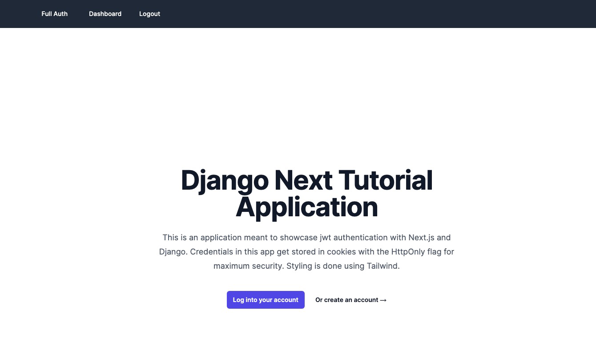

# django-next-template 🚀

## Overview 📖

`django-next-template` is a full-stack web application boilerplate, artfully combining Django's robust backend with Next.js's sleek frontend. This template is meticulously crafted for developers seeking a harmonious blend of Django's powerful backend capabilities and Next.js's seamless React-based frontend experience.



### Key Features and Technologies ✨

- **Django Backend**: Robust and scalable, perfect for complex logic and database handling 🎯.
- **Next.js Frontend**: Modern React framework for building seamless, user-friendly interfaces 💻.
- **Tailwind CSS**: A utility-first CSS framework for rapid UI development 🎨.
- **PostgreSQL Database**: Reliable and powerful database management system 🗄️.
- **Docker Integration**: Simplify development and deployment with containerization 🐳.
- **Complete JWT Authentication**: Secure and ready-to-use JSON Web Token (JWT) authentication 🔒.
- **Poetry for Dependency Management**: Efficient management of Python packages 📦.
- **Local and Docker Development**: Flexible setup for local and containerized environments 🌐.

## Getting Started 🌟

Follow these instructions to get a copy of the project up and running on your local machine for development and testing purposes.

### Prerequisites 📋

- Docker and Docker Compose (for Docker setup)
- Node.js and npm (for local frontend development)
- Python 3.11 and Poetry (for local backend development)

### Installation and Running with Docker 🐳

1. **Clone the Repository**:
   ```bash
   git clone https://github.com/your-repo/django-next-template.git
   cd django-next-template
   ```

2. **Start the Docker Containers**:
   ```bash
   docker-compose up
   ```

3. **Access the Application**:
   - Backend: `http://localhost:8000`
   - Frontend: `http://localhost:3000`

### Running Locally Without Docker 🖥️

#### Backend (See [backend README](./backend/README.md))

- Instructions on running the Django backend locally with Poetry.

#### Frontend (See [frontend README](./frontend/README.md))

- Guidelines for running the Next.js frontend with Tailwind CSS locally.

## Development 🛠️

Explore our development process, guidelines, and best practices.

### Directory Structure 🗂️

- `/backend`: All Django backend-related files.
- `/frontend`: All Next.js frontend-related files.

### Testing 🔍

- How to run tests for both the frontend and backend. [To be added]

## Deployment 🚀

- Guidelines for deploying the application in a production environment. [Coming Soon]

## Contributing 🤝

- We welcome contributions! See how you can contribute to this project.
